# MWA Satellites
Code to measure the beam shapes of MWA Tiles using satellites.  

### Conda Environment

A conda virtual enviroment is used to install the correct version of python and all required packages in an isolated enviroment, ensuring that our code performs as expecteted. Either [Anaconda](https://www.anaconda.com/distribution/) or [Miniconda](https://docs.conda.io/en/latest/miniconda.html) are required before proceeding further. All the required packages are in `env.yml`, which can be installed using:
```
source setup.sh
```
This creates a conda enviroment, called sat-env, for out mwa-satellites repository. This virtual conda enviroment can be activated and deactivated with:

```
conda activate sat-env

conda deactivate
```

When running code in this repository, ensure that `sat-env`is active.

&nbsp;
#### Directory Structure

```
.
├── code                    # Code lives here
├── docs                    # Documentation files
├── data                    # Sample data and beam maps
├── outputs                 # All outputs saved here by default
├── setup.sh                # Creates conda virtual env with dependancies
├── env.yml                 # Conda environment file
├── LICENSE                 
└── README.md
```

&nbsp;
### Decode RF Explorer Data

The RF Explorers saves a single line of data, per time step, to a text file. This contains a timestamp, in UNIX time, and a binary string of power data, corresponding to power in dB per frequency channel. `rf_data.py` has two functions. The first, decodes the rf data files and returns a list of times, and a 2D array of powers. The second function used the time and power arrays to create a waterfall plot. This is an extremely useful diagnostic tool, displaying satellite passes at bright vertical streaks. 

```
cd ./code/decode_rf_data/

python plot_waterfall.py --help

python plot_waterfall.py --rf_name=rf0XX_2019-10-10-02:30
python plot_waterfall.py --rf_name=S10XX_2019-10-10-02:30
```

Can be used to plot a waterfall from a single rf data file. The above code creates waterfall plots from the two sample data files provided in the `data` directory. On the left is the waterfall plot of the reference antenna, with an obvious broadband weather satellite pass visible at the bottom right. The narrower vertical lines are ORBCOMM satellites. The plot on the right shows the same satellites as seen by an MWA tile. The nulls in the primary beam are clearly visible. 

<p float="left">
  
  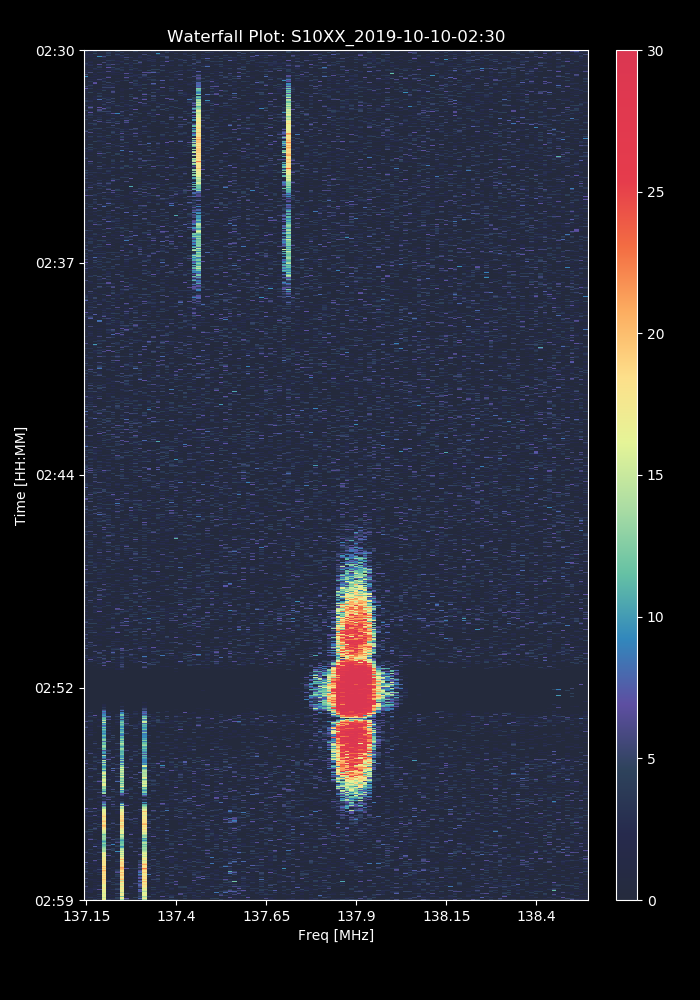 
</p>

To plot a large batch of waterfall plots, use `batch_waterfall.py`. Using a start date, and stop date, it plots waterfall plots of all data found between them.

```
python batch_waterfall.py --help
```

A `logs.txt` file is saved to the output directory. This shows what plots were saved by `batch_waterfall.py`, and also which data files were missing.

&nbsp;
### Align Data

The RF Explorers do not record data at exactly the same frequency and do not start recording at exactly the same time. In fact, the older models record at approximately 6 Hz, while the newer ones are capable of a sampling rate of nearly 9 Hz. This discrepency in sampling rates makes it difficult to compare any two data samples. This issue is overcome by smoothing the data, along the time axis, with a Savitzky-Golay filter. Interpolating the smoothed data and resampling it at a constant frequency [ 0.5 Hz ] gives us a easier data set to work with. The starting times of the power arrays are also synchronized.

```
cd ../align_data

python align_data.py
```

<p float="left">
  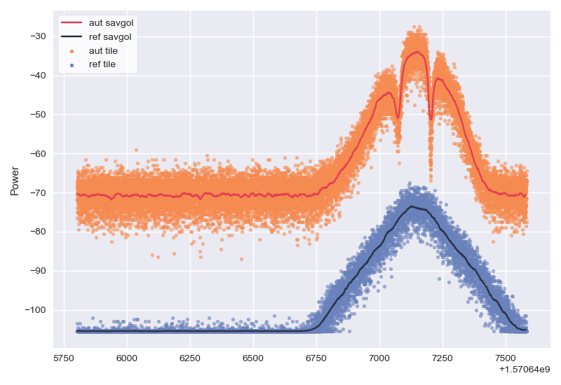 
</p>

This illustrates how `align_data.py` smoothes the noisy power data. The image displayed above represents only one frequency channel  [59] from the 2D power array. This channel was chosen to best show the spectral features of satellite passes as seen by the reference and mwa tiles. 

In practince, savgol smoothing and interpolation are applied to the 2D power arrays, along the time axis.

Aligned pairs of data sets are saved using `batch_align.py`. Using a start date, and stop date, it saves aligned data sets as .npz files, for all raw data found in the time interval.

```
python batch_align.py --help
```

A `logs.txt` file is saved to the output directory. This shows which data sets were saved by `batch_align.py`, and also which data files were missing.


&nbsp;
### Satellite Ephemeris  

72 satellites have been identified, which actively emit between 137.150 and 138.550 MHz. These satellites are identified by their unique NORAD Catalogue Number, which are hard-coded into `sat_ids.py`. The satellites of interest are ORBCOMM communication Satellites, NOAA and Meteor weather satellites. 

In this section of code we determine the trajectories of our satellites of interest.

`cd ../sat_ephemeris`

#### 1. Download Two Line Elements [ TLEs ]
Two Line Elements contain information about the orbital elements of Earth-orbiting objects. They can be used to determine the ephemeris of satellites. Relevant TLEs are downloaded from [Space-Track.org](https://www.space-track.org/) using the [spacetrack](https://pypi.org/project/spacetrack/) Python module. An account on space-track.org is required to download TLEs. 


`python download_tle.py --help` gives all options.  

`python download_tle.py --start_date=YYYY-MM-DD --stop_date=YYYY-MM-DD`   

#### 2. Satellite Ephemeris

A python astronomy package, [Skyfield](https://rhodesmill.org/skyfield/), is used to make sense of the TLEs. Every pair of lines (tle elements) in the TLE file corresponds to a particular epoch - a time at which the satellite's possition can be determined most accurately, before or after which it goes rapidly out of date. [Space-Track.org](https://www.space-track.org/) releases new TLEs for satellites at least once a day. `sat_ephemeris.py` determined the epochs of each pair of tle elements in a `TLE.txt` file, and used the elements which are most accurate. 

The MWA Satellite experiment is situated in remote Western Australia, at the Murchison Radio-astronomy Observatory. The latitude, longitude and elevation of the site are hard-coded into `sat_ephemeris.py`. Skyfield uses this in conjunction with the TLE files to determine the trajectories of satellite. `sat_ephemeris.py` computes the altitude and azimuth [alt/az] of the satellite at a particular time cadence. By default this is set to 2 seconds, and this step is computationally expensive and can dramatically slow things down. 

```
python sat_ephemeris.py --help

python sat_ephemeris.py --sat=XXXXX --cadence=20 
```
This produces a rise time `t_rise`, set time `t_set`, in gps seconds, for each satellite pass. It also produces a corresponding list of altitudes and azimuths for each pass. These are saved to a json file, to be used later. The following can be used to create ephemeris json files for all satellite tle files.

```
python batch_sat_ephem.py --help
```

A log file is also saved in the `./../../output/sat_ephemeris/ephem_json/sat_ephem_logs.txt` directory, showing if any errors occured.


&nbsp;
#### 3. Plot Ephemeris

Using the json files created in the previous section, we can now plot satellite passes. This will give us an idea of sky coverage, and how much integration is required to build up a complete beam map.

```
python plot_ephemeris.py --help

python plot_ephemeris.py
```
This will plot all the json ephemeris files that were generated in the previous section, and will save them to `../../outputs/sat_ephemeris/ephem_plots/`

&nbsp;

<p float="left">
  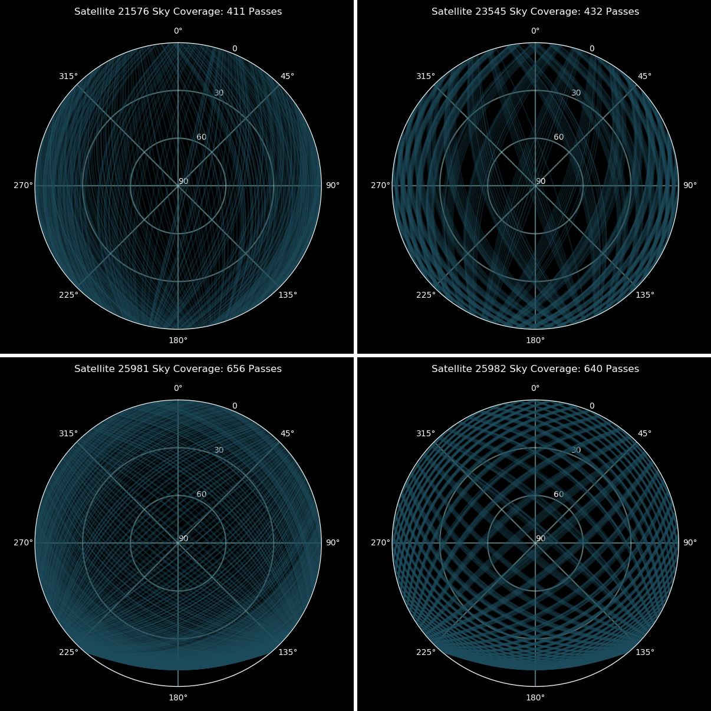
</p>


#### 4. Chronological Ephemeris

In later stages of this analysis we will need satellite ephemeris in chronological order. `chrono_ephem.py` collates data in all the json files produced by `sat_ephemeris.py`. As a first step, the gps timestamps used by `skyfield`, are converted to unix timestamps, to match the format used in the rf explorer data. Next, the satellite alt/az ephemeris are interpolated, to match the time cadence of `align_data.py`. It is crutial to remember to set `--interp_freq` to be the same as that used in `align_data.py`, or just use the default of 0.5 Hz. For each 30 min observation, a corresponding sat ephem file is created in `./../../outputs/sat_ephemeris/chrono_json/` which contains all the satellite passes within the given time window. 

```
python chrono_ephem.py --help
```


&nbsp;
### Satellite Channels

As access to the ORBCOMM interface box was not available, the channels in which each satellite transimits can be determined with a careful analysis of the RF data and satellite ephemeris.

We use reference data to detect satellite channels and it is much less noisy. Pairings a reference RF data file, with it's corresponding chrono_ephem file gives us the raw data as well as all the satellite which we expect to be present in 30 minute observation window. The chrono_ephem.json file containes the ephemeris for each of these satellites.

We initially chose 72 satellites, which we hoped transimited in our frequency band. We need to verify whether this is actually the case, and eliminate satellite which are out of our band.

Looping over all satellites, we identify when each is present in the data and select the temporal region of the rf data where we expect to see its signal. Let us call this the *window*. We now use a series of thresholding criteria to help identify the most probable channel.

#### Channel Filtering 

The following thresholds were used to identify the correct channel:

* Arbitrary threshold
* Noise threshold
* Window Occupancy


The peak signal in our data is `~ 30 dB` above the noise floor. We define an arbitrary threshold at `10 dB` and require that the maximum signal in a channel must exceed this value, if it contains a satellit.

Our observation windows are sparesely populated with satellite signal. We classify any channel with a maximum signal below *1σ* to be *noisy data*. We find the *median [μ_noise]* of the *noisy data* and it *Median Absolute Deviatio [σ_noise]*. Using these we construct a noise threshold of *μ_noise + N x σ_noise*. By default N = 3. We now use this noise threshold to more rigorously choose channels with satellites present.

We also demand that the signal at the edges of the *window* be below the noise threshold. This ensures that the satellite begins and ends within the expected region. 

A fractional occupancy of the window is computed by finding length of signal above the noise floor and dividing it by the window length. We require that *0.8 ≤ occupancy < 1.0*. By requiring that occupancy is less than `1.0`, we ensure that satellite passes longer than the window are not classified as potential channels.

We use `sat_channels.py` to determine all the possible channels that each satellite occupies, and the total number of passes in each channel. This data is saved as json files in `/outputs/sat_channels/channel_data`. `channel_occupancy.py` uses the json files to plot histograms of occupied channels for each satellite in `/outputs/sat_channels/histograms`.

```
cd ../sat_channels

python sat_channels.py --help

python channel_occupancy.py
```

<p float="left">
  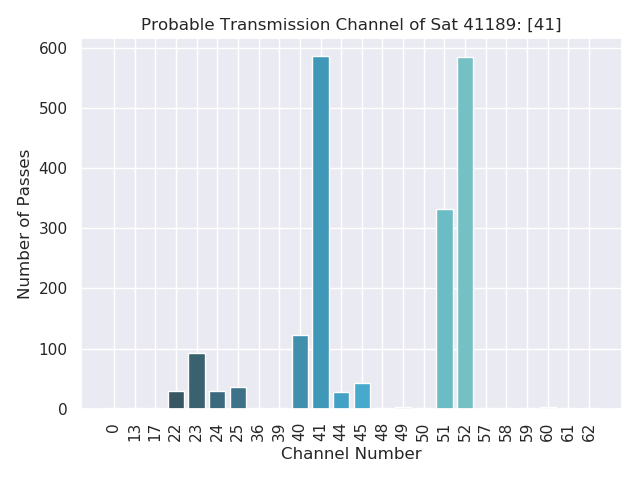
  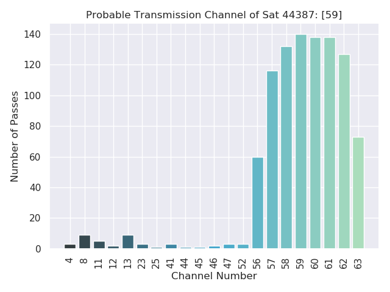
</p>

<p float="left">
  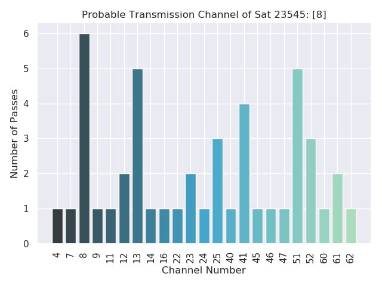
  
</p>

From the ephemeris plots, we know that we expect at least hundreds of passes per satellite. In the first two histograms we have more than 1000 passes each. The top right histogram is of a NOAA Weather satellite, which emits in multiple frequencies. The bottom two histograms have less than hundred passes each, which indicates that the satellite probably emits outside our band, and the passes identified in the histogram were misclassified. Using the histograms, we identify satellites with less than hundred passes and remove them from our satellite list `/sat_ephemeris/sat_ids.py`. This reduces the computation and complexity in the future. Based on our data, 17 satellites were found to not emit in our frequency band. 

#### Window Channel Maps

Since our satellites did not constantly emit in one frequency channel over the 5 month period of our experiment, we make a *window map* for every half hour observation using `window_chan_map.py`. Each map identified the channels of all satellites in the 30 minute observation using similar criteria as above - noise, arbitrary and occupation thresholds. if the `--plots=True` argparse option is used, a waterfall plot of each observation is generated, with the time window of the satellite and possible channels highlighted. The most probable channel is highlighted in green, as seen below.

```
python window_chan_map.py --help
```


<p float="left">
  
  
</p>

<p float="left">
  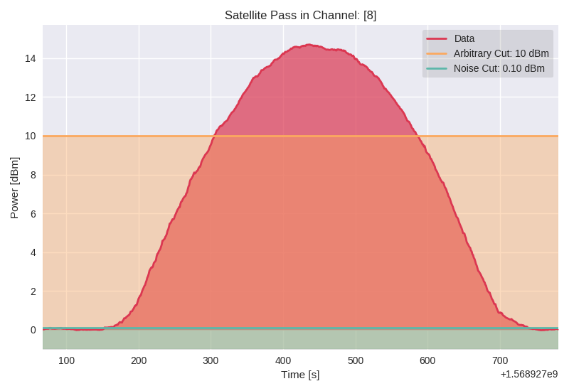
  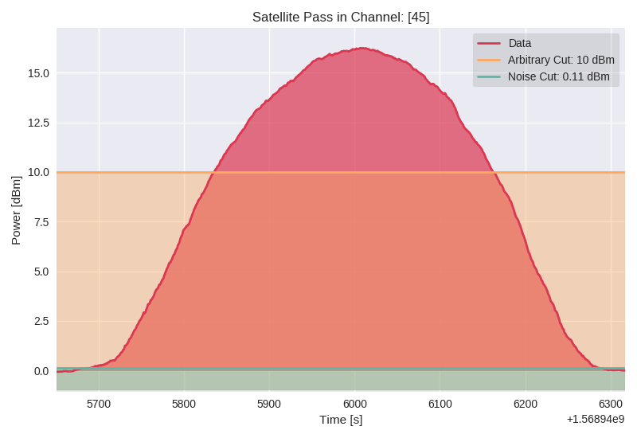
</p>


&nbsp;
### Reproject Reference Beam Models

FEKO simulations were run to generate FEE beam models for the reference antennas. A model was generated for the XX & YY polarization of the reference antennas and is saved in `/data/FEE_Reference_Models/`. The `.ffe` files generated by FEKO need to be converted to something that we can use. `project_beam2healpix.py` finds the power in the beam, interpolates and rotates it into a healpix projection. The FEE beam is scaled such that its power at zenith is 0 dB.

```
cd ../reproject_ref

python project_beam2healpix.py
```

This will create `ref_dipole_models.npz` and a diagnostic plot of the beams in the output directory `../../outputs/reproject_ref/reproject_dipole_models.png`.

<p float="left">
   
</p>


&nbsp;
### Beam Pointings

The MWA Telescope points its beam in different directions by giving each of its 16 dipoles a different delay. These pointings are quantised, with 181 discrete pointings available, each of which is given a unique 'Grid-pointing' number.  

It is important to know where the telescope is pointing at all times, because we will be making individual beam maps for each pointing. This metadata is available at [http://ws.mwatelescope.org](http://ws.mwatelescope.org/metadata/find). Metadata form the MWA telescope can be downloaded by following these steps.

```
cd ../beam-pointings/
```

let us download date between `2019-09-11 00:00:00` and `2019-11-02 00:00:00`. 
First, we need to convert these dates to gps-seconds.

```
python date_gps.py --date='2019-09-11 00:00:00'
gps: 1252195218

python date_gps.py --date='2019-11-02 00:00:00'
gps: 1256688018
```

Next, open [http://ws.mwatelescope.org](http://ws.mwatelescope.org/metadata/find). Enter the start and stop time. Also change the page size to 200. Leave all the other fields un-checked, as shown below. Finally, click `search`.


<p float="left">
  
</p>

The important thing to note is the number of pages that are returned by the search. In this particular case it is 74.

<p float="left">
  
</p>

Using this information we can download the required metadata using `download_pointings.sh`. The site limits queries to approximately 200 per minute, which is why these steps were necessary.

```
source download_pointings.sh 74 1252195218 1256688018
```

The results of each page are downloaded to a json file in the `./../../ouputs/beam_pointings/` directory. The download script sleeps for 66s between each download, so as not to overload the MWA data servers.


The next step is to collate the data in all these discrete json metadata files into and `ultimate_pointing_times.json` list. This is slightly tricky, as there are a days when the MWA is idle as a whole, but the MWA Satellite experiment is recording data. This means that the metadata we downloaded will not contain any info on these times, and we must infer the pointing of the telescope from the last pointing the receivers were in. 

```
python sort_pointings.py
```

This creates an `ultimate_pointing_times.json` file in the metadata directory. `pointing_list.py` has condensed observations with the same pointing into blocks of observation. Each entry in `ultimate_pointing_times.json` contains the `grid_pt` number, `start_gps`, `stop_gps` time and `obs_length` in seconds.

A good way to visualise the amount of data collected so far is to use `plot_pointings.py`. This computes total integration over each pointing, and converts it into hours, and saves a plot to `pointing_integration.png`. The plot below represent data between `2019-09-10` and `2020-03-17`.

```

python plot_pointings.py
```

<p float="left">
  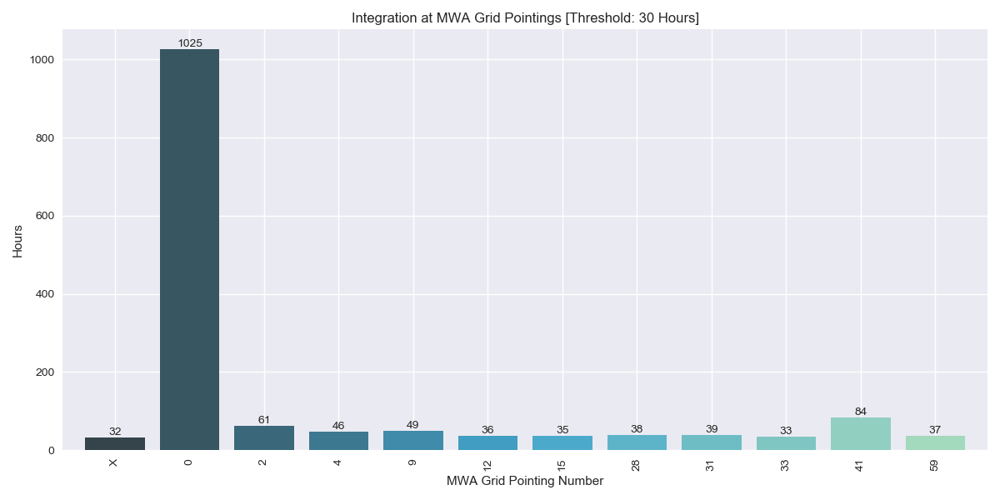
</p>

We now need to classify the pointing of each 30 minute observation. 

```
python obs_pointings.py --help
```

This creates `obs_pointings.json` in the output directory, which contain three lists, for the three pointings which we are interested in. Each list contains the observations with the correct pointings. Next, using `tile_pointings.py` we create `tile_pointing_integration.png`, in the outputs folder, to examine how much integration each of the 32 tiles have. Because we had continuous failures of our equipment, some tiles have significanly less data than others.

```
python tile_pointings.py --help
```

<p float="left">
  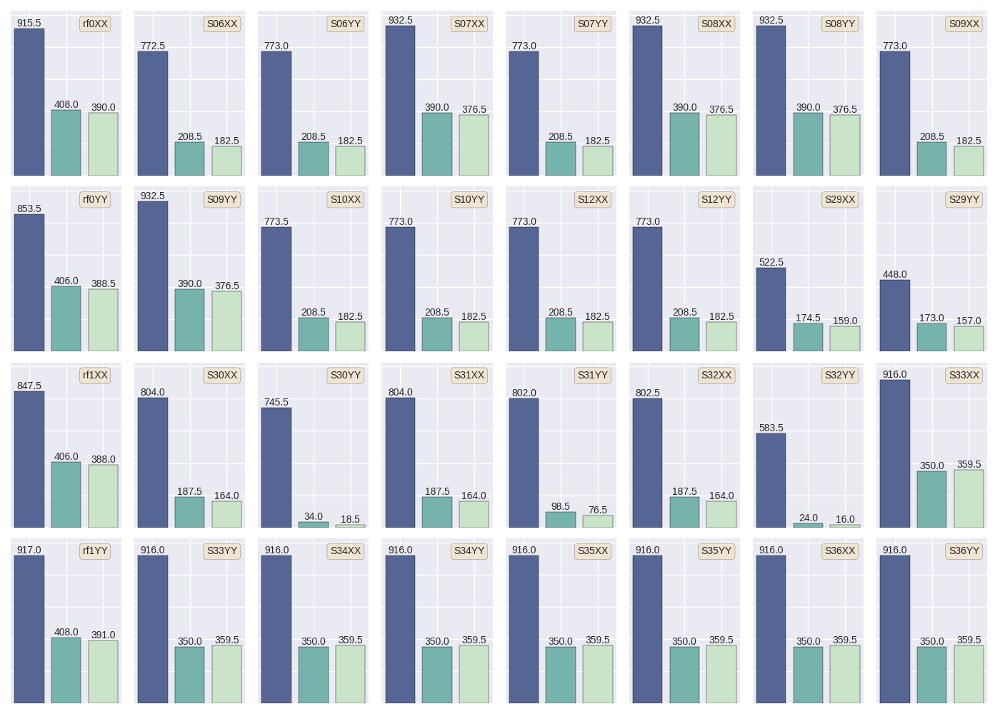
</p>


&nbsp;
### Tile Maps


This section is where everything finally comes together.  We project the aligned satellite data onto healpix maps according to their ephemeris, using the channel maps to only project the good data. This is doen using `tile_maps.py` The resulting maps are stored in `.npz` files in the `./outputs/tile_maps/tile_map_data` directory. The data is stored as nested dictionaries.

```
cd ../tile_maps/

python tile_maps --help
```

The resulting `.npz` files have the following internal structure.

```
data
├── ratio_map                
│   └── pointings            
│       └── satellites            
│           └── healpix maps            
├── ref_map                   
│   └── pointings            
│       └── satellites            
│           └── healpix maps            
├── tile_map                  
│   └── pointings            
│       └── satellites            
│           └── healpix maps            
└── time_map
    └── pointings            
        └── satellites            
            └── healpix maps
```

The highest level dictionary contains ratio, reference, tile and time maps. Within each of these, there are dictionaries for each of the telescope pointings:`0, 2, 4`. Within each of these, there are dictionaries for each satellite norad ID, which contain a healpix map of data from one satellite, in one pointing. This structure map seem complicated, but is very useful for diagnostic purposes, and determining where errors in the final tile maps come from. The time maps contain the times of every data point added to the above maps.


We can now finally create some beam maps using

```
python plot_healpix.py
```

This reads the healpix maps created by `tile_maps.py`, and creates two sets of maps. First, it creates a directory `../../outputs/tile_maps/sat_maps` where for each pointing of the telescope, it creates maps from individual satellite passes, from one representative tile. This enables up to see whether some satellites are adding anomalous data to our final maps. It also creates `../../outputs/tile_maps/good_maps`, where tile maps are created for each pointing, and for every tile.

#### Zenith Maps
<p float="left">
  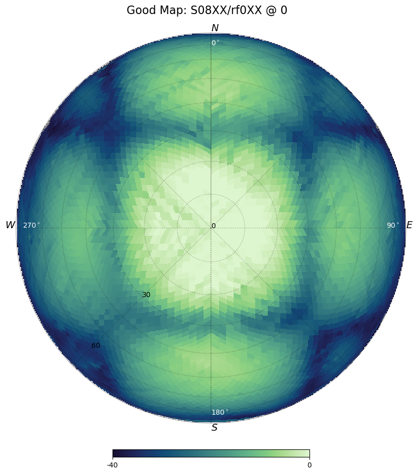
  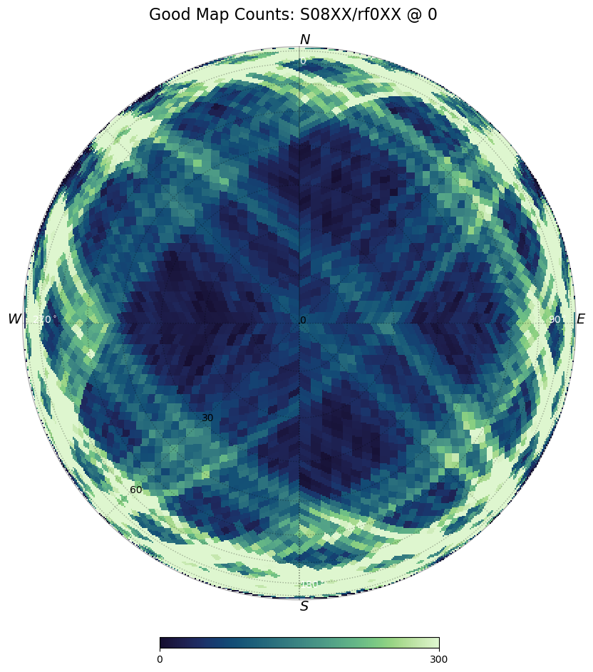
  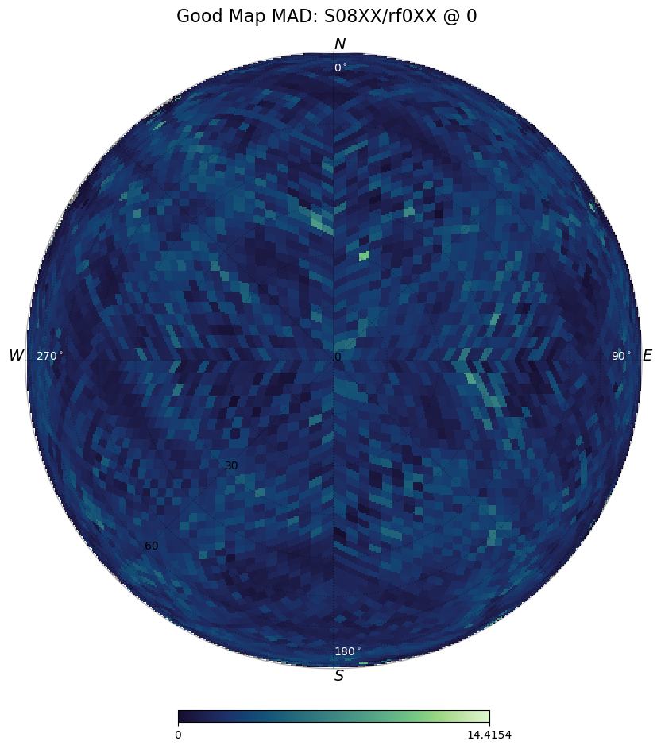
</p>

#### Sweet Point 2
<p float="left">
  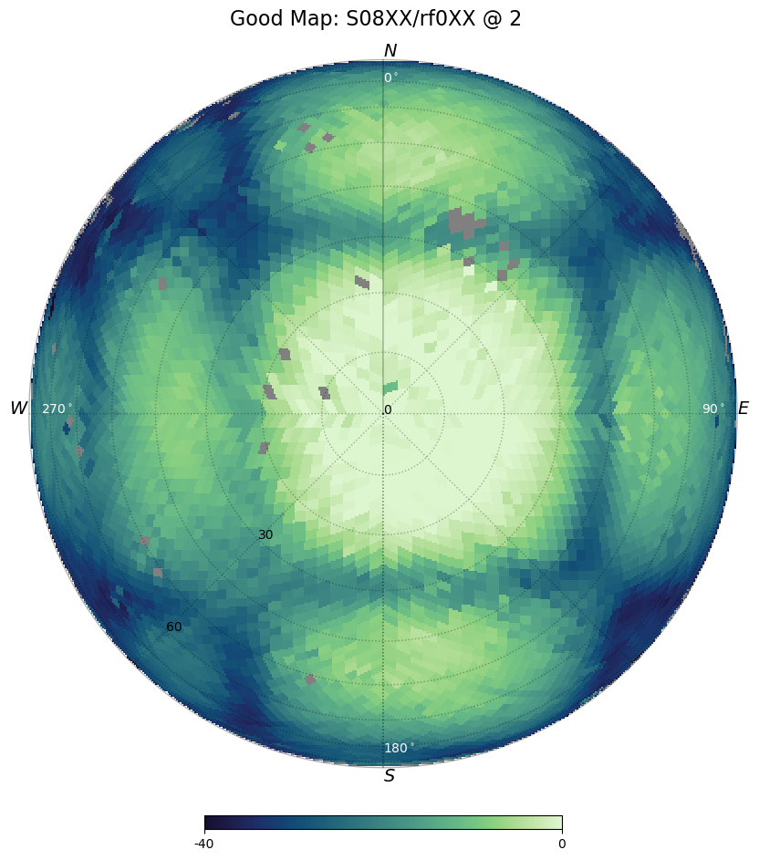
  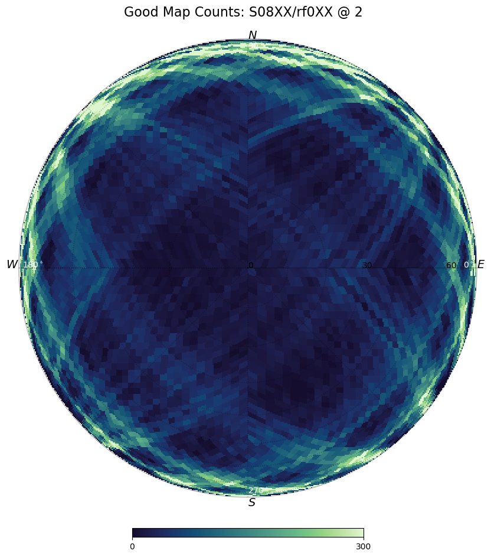
  
</p>

#### Sweet Point 4
<p float="left">
  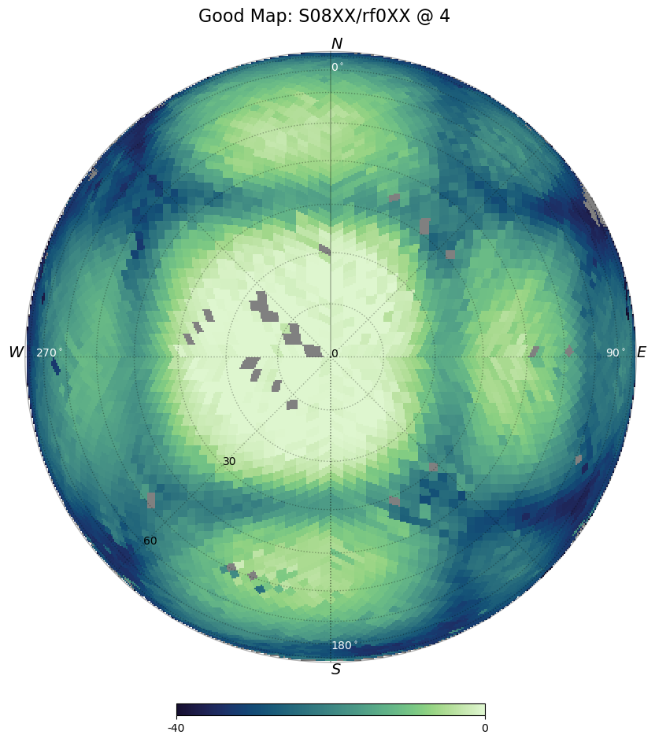
  
  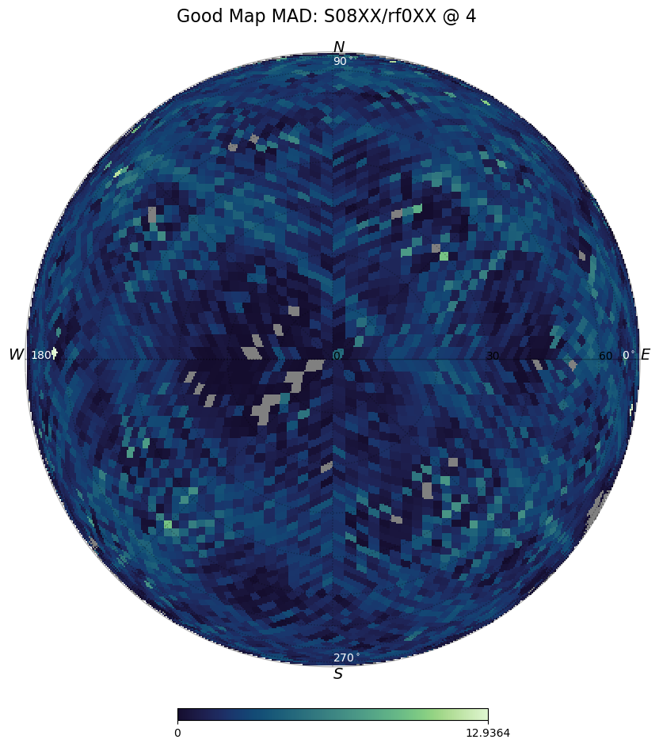
</p>


In this section we perform a sanity check, to make sure that both our reference antennas have the same performance. `project_pass_healpix.py` projects all satellite passes detected in the reference data to a healpix map. The script looks in each ref data file between two dates, and using the corresponding chrono ephem .json files with the window maps, detects each satellite pass. We use the arbitrary and noise threshold described in the satellite channel section. Signal which pass both thresholds are considered good, and their corresponding altitude and azimuth are determined from the ephem file. These are projected to a healpix map. The healpix map is rotated by (π/4), so that the cardinal axes (NS, EW), lie on rows of healpix pixels. This will be essential when we look at the profiles of the beam shape. Two arrays are created - `ref_map` & `ref_map_counter`. In `ref_map`, each row represents a healpix pixel, with its values being a list of power from all passes over that pixel. `ref_map_counter` holds a count of the number of passes at each healpix pixel. These arrays are saved to an `.npz` file in the `/outputs/null_test` directory.


Perform the actual null test and create some interesting plots with

```
python null_test.py --help
```

We now compare corresponding EW and NS slices of both reference antennas. The four reference maps we created above are slices along the two cardinal axes. We compute the meadian value of each pixel, and estimate it's error using the Median Absolute Deviation. We rotate our FEE models by (π/4), to match the rotation of our data, and slice it along NS & EW. We use a least square minimization to determine a single gain factor which will best fit out model to our data. We plot the residuals to see if it has any significant structure. The null test is performed by subtracting corresponding data from one ref with the other. For Example, in the plot below, consider the first column. The first plot shows the NS slice of the rf0XX beam, with the NS slice of the rf1XX beam below it. The green points represent our data and errors, while the crimson curve represents the FEE model fitted to the data. The blue data points are the residuals between our data and the FEE model, while the orange curve is a 3rd order polynomial fit to it. The last plot displays the difference between the two plots above it. 

<p float="left">
  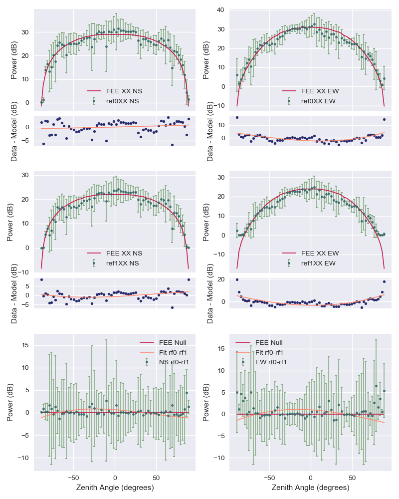
</p>


