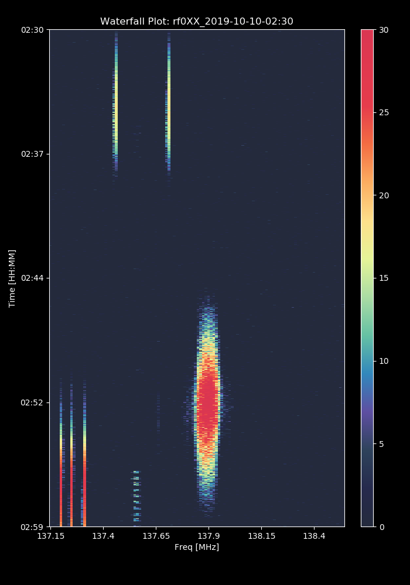
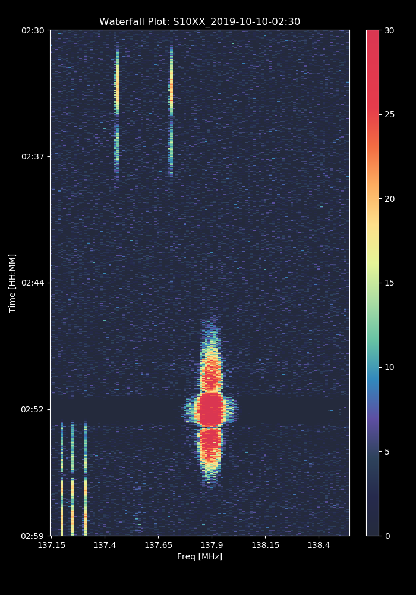
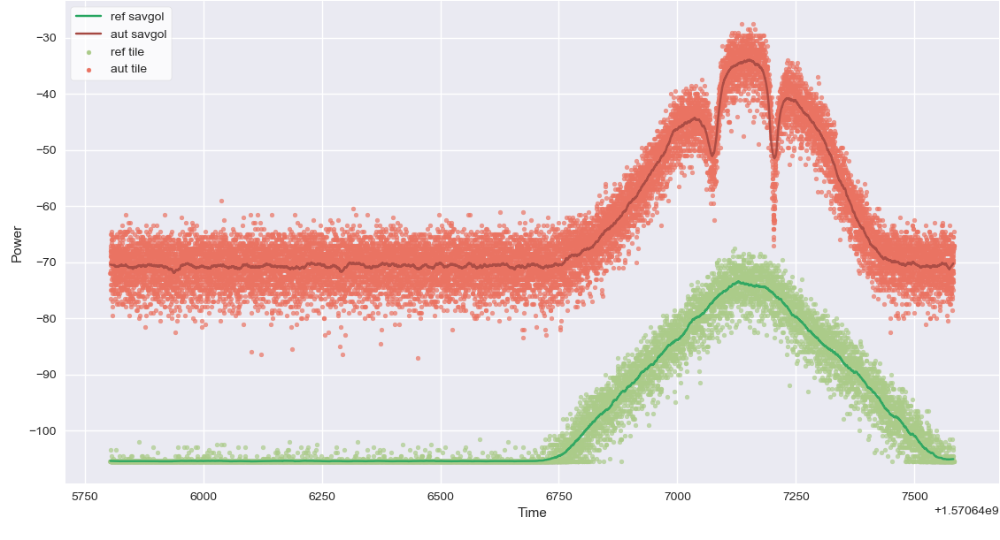
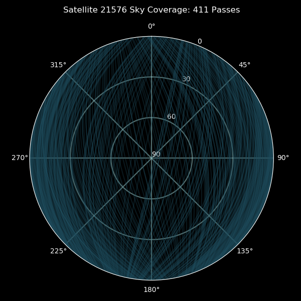
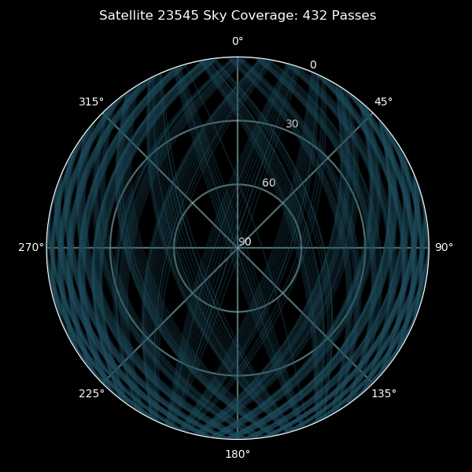
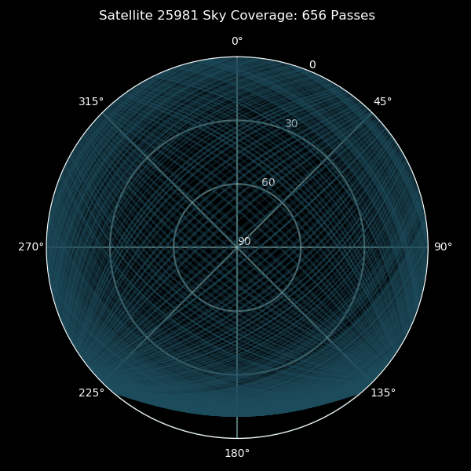
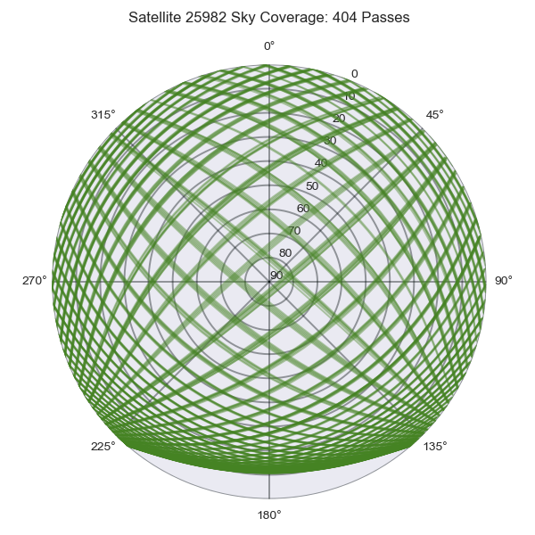
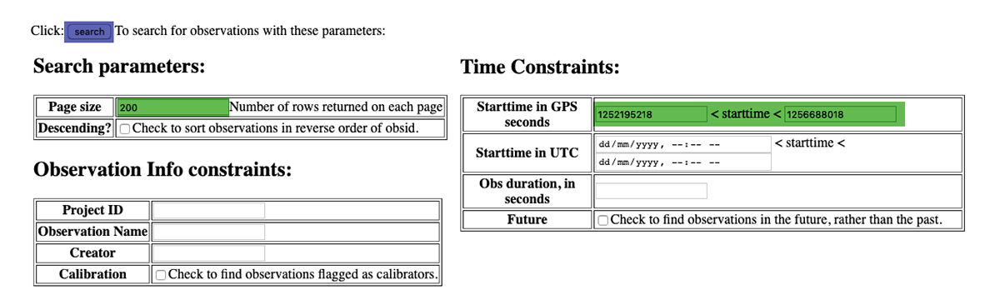
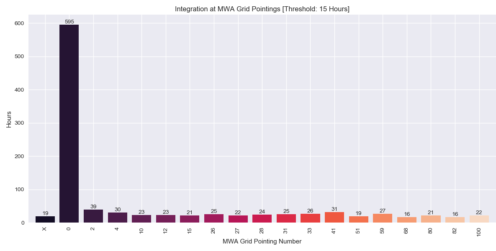

# MWA Satellites
Code to measure the beam shapes of MWA Tiles using satellites.  

### Conda Environment

A conda virtual enviroment is used to install the correct version of python and all required packages in an isolated enviroment, ensuring that our code performs as expecteted. Either [Anaconda](https://www.anaconda.com/distribution/) or [Miniconda](https://docs.conda.io/en/latest/miniconda.html) are required before proceeding further. All the required packages are in `env.yml`, which can be installed using:
```
source setup.sh
```
This creates a conda enviroment, called sat-env, for out mwa-satellites repository. This virtual conda enviroment can be activated and deactivated with:

```
conda activate sat-env

conda deactivate
```

When running code in this repository, ensure that `sat-env`is active.

&nbsp;
### Decode RF Explorer Data

The RF Explorers saves a single line of data, per time step, to a text file. This contains a timestamp, in UNIX time, and a binary string of power data, corresponding to power in dB per frequency channel. `rf_data.py` has two functions. The first, decodes the rf data files and returns a list of times, and a 2D array of powers. The second function used the time and power arrays to create a waterfall plot. This is an extremely useful diagnostic tool, displaying satellite passes at bright vertical streaks. 

```
cd ./code/decode_rf_data/

python plot_waterfall.py --help

python plot_waterfall.py --rf_name=rf0XX_2019-10-10-02:30
python plot_waterfall.py --rf_name=S10XX_2019-10-10-02:30
```

Can be used to plot a waterfall from a single rf data file. The above code creates waterfall plots from the two sample data files provided in the `data` directory. On the left is the waterfall plot of the reference antenna, with an obvious broadband weather satellite pass visible at the bottom right. The narrower vertical lines are ORBCOMM satellites. The plot on the right shows the same satellites as seen by an MWA tile. The nulls in the primary beam are clearly visible. 

<p float="left">
  
   
</p>

To plot a large batch of waterfall plots, use `batch_waterfall.py`. Using a start date, and stop date, it plots waterfall plots of all data found between them.

```
python batch_waterfall.py --help
```

### Align Data

The RF Explorers do not record data at exactly the same frequency and do not start recording at exactly the same time. In fact, the older models record at approximately 6 Hz, while the newer ones are capable of a sampling rate of nearly 9 Hz. This discrepency in sampling rates makes it difficult to compare any two data samples. This issue is overcome by smoothing the data, along the time axis, with a Savitzky-Golay filter. Interpolating the smoothed data and resampling it at a constant frequency gives us a easier data set to work with. The starting times of the power arrays are also synchronized.

```
cd ../align_data

python align_data.py
```

<p float="left">
   
</p>

This illustrates how `align_data.py` smoothes the noisy power data. The image displayed above represents only one frequency channel  [59] from the 2D power array. This channel was chosen to best show the spectral features of satellite passes as seen by the reference and mwa tiles. 

In practince, savgol smoothing and interpolation are applied to the 2D power arrays, along the time axis.

### Satellite Ephemeris  

72 satellites have been identified, which actively emit between 137.150 and 138.550 MHz. These satellites are identified by their unique NORAD Catalogue Number, which are hard-coded into `sat_ids.py`. The satellites of interest are ORBCOMM communication Satellites, NOAA and Meteor weather satellites. 

In this section of code we determine the trajectories of our satellites of interest.

`cd ./code/sat-ephemeris`

#### 1. Download Two Line Elements [ TLEs ]
Two Line Elements contain information about the orbital elements of Earth-orbiting objects. They can be used to determine the ephemeris of satellites. Relevant TLEs are downloaded from [Space-Track.org](https://www.space-track.org/) using the [spacetrack](https://pypi.org/project/spacetrack/) Python module. An account on space-track.org is required to download TLEs. 


`python download-tle.py --help` gives all options.  

`python download-tle.py --start_date=YYYY-MM-DD --stop_date=YYYY-MM-DD`   

#### 2. Satellite Ephemeris

A python astronomy package, [Skyfield](https://rhodesmill.org/skyfield/), is used to make sense of the TLEs. Every pair of lines (tle elements) in the TLE file corresponds to a particular epoch - a time at which the satellite's possition can be determined most accurately, before or after which it goes rapidly out of date. [Space-Track.org](https://www.space-track.org/) releases new TLEs for satellites at least once a day. `sat_ephemeris.py` determined the epochs of each pair of tle elements in a `TLE.txt` file, and used the elements which are most accurate. 

The MWA Satellite experiment is situated in remote Western Australia, at the Murchison Radio-astronomy Observatory. The latitude, longitude and elevation of the site are hard-coded into `sat_ephemeris.py`. Skyfield uses this in conjunction with the TLE files to determine the trajectories of satellite. `sat_ephemeris.py` computes the altitude and azimuth [alt/az] of the satellite at a particular time cadence. By default this is set to 20s, and this step is computationally expensive and can dramatically slow things down. 

```
python sat_ephemeris.py --help

python sat_ephemeris.py --sat=XXXXX --cadence=20 
```
This produces a rise time `t_rise`, set time `t_set`, in gps seconds, for each satellite pass. It also produces a corresponding list of altitudes and azimuths for each pass. These are saved to a json file, to be used later.


#### 3. Plot Ephemeris

Using the json files created in the previous section, we can now plot satellite passes. This will give us an idea of sky coverage, and how much integration is required to build up a complete beam map.

```
python plot_ephemeris.py --help

python plot_ephemeris.py --sat=XXXXX
```
&nbsp;

<p float="left">
  
   
</p>


<p float="left">
  
   
</p>


#### 4. Chronological Ephemeris

In later stages of this pipeline, we will need satellite ephemeris in chronological order. `chrono_ephem.py` collates data in all the json files produced by `sat_ephemeris.py`. Satellite passes are sorted by rise time, and saved to a new file `ultimate_ephem_list.json`.

```
python chrono_ephem.py --help

python chrono_ephem.py
```

### Beam Pointings

The MWA Telescope points its beam in different directions by giving each of its 16 dipoles a different delay. These pointings are quantised, with 181 discrete pointings available, each of which is given a unique 'Grid-pointing' number.  

It is important to know where the telescope is pointing at all times, because we will be making individual beam maps for each pointing. This metadata is available at [http://ws.mwatelescope.org](http://ws.mwatelescope.org/metadata/find). Metadata form the MWA telescope can be downloaded by following these steps.

```
cd ./code/beam-pointings/
```

let us download date between `2019-09-11 00:00:00` and `2019-11-02 00:00:00`. 
First, we need to convert these dates to gps-seconds.

```
python date_gps.py --date='2019-09-11 00:00:00'
gps: 1252195218

python date_gps.py --date='2019-11-02 00:00:00'
gps: 1256688018
```

Next, open [http://ws.mwatelescope.org](http://ws.mwatelescope.org/metadata/find). Enter the start and stop time. Also change the page size to 200. Leave all the other fields un-checked, as shown below. Finally, click `search`.


<p float="left">
  
</p>

The important thing to note is the number of pages that are returned by the search. In this particular case it is 74.

<p float="left">
  
</p>

Using this information we can download the required metadata using `download_pointings.sh`. The site limits queries to approximately 200 per minute, which is why these steps were necessary.

```
source download_pointings.sh 74 1252195218 1256688018
```

The results of each page are downloaded to a json file in the `./../../ouputs/beam_pointings/` directory. The download script sleeps for 66s between each download, so as not to overload the MWA data servers.


The next step is to collate the data in all these discrete json metadata files into and `ultimate_pointing_times.json` list. This is slightly tricky, as there are a days when the MWA is idle as a whole, but the MWA Satellite experiment is recording data. This means that the metadata we downloaded will not contain any info on these times, and we must infer the pointing of the telescope from the last pointing the tiles were in. Luckily, the operators of the MWA run a set of 20 dipole test observations in the morning, the last of which resets the telescope to zenith. 

```
python pointing_list.py --help

python pointing_list
```

This creates an `ultimate_pointing_times.json` file in the metadata directory. `pointing_list.py` has condensed observations with the same pointing into blocks of observation. Each entry in `ultimate_pointing_times.json` contains the `grid_pt` number, `start_gps`, `stop_gps` time and `obs_length` in seconds.

A good way to visualise the amount of data collected so far is to use `plot_pointings.py`. This computes total integration over each pointing, and converts it into hours. A threshold value can be set, which difines a time below which a pointing is not plotted. The default is 15 hours.

```
python plot_pointings.py --help

python plot_pointings.py
```

With the default setting, a plot called `pointing_integration.png`will be created and saved to the default metadata folder. 


<p float="left">
  
</p>

The `X` bar to the left of the plot represents time when the telescope was under maintainance, and had no definite pointing.
