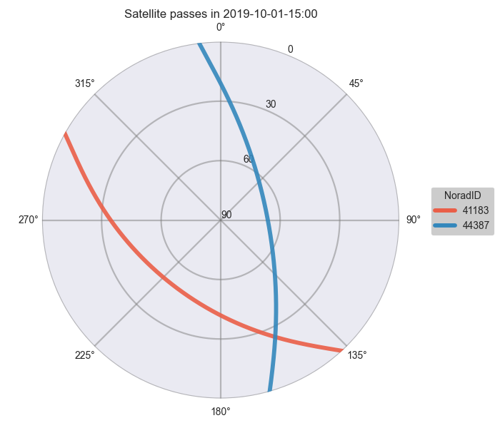
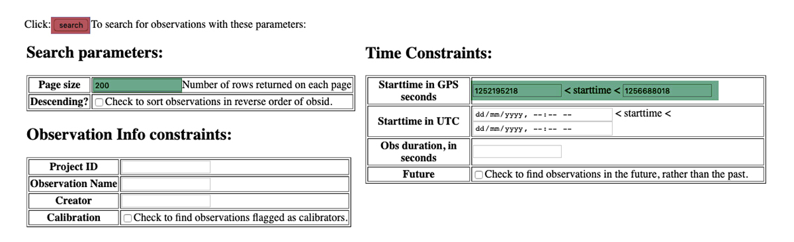

===================
 Embers by Example
===================

The primary use case for *EMBERS* is the analysis of Radio Data obtained during the measurement of `MWA <https://www.mwatelescope.org/>`_ antenna beam-patterns
using satellites. The following examples outline the pipline used in the analysis of data for the Paper [Coming soon].

Setup
-----
*EMBERS* works best in a virtual environment and requires Python > 3.6. Follow the :doc:`Installation Instructions <installation>` to setup a suitable enviroment.

.. code-block:: console

    $ mkdir ~/EMBERS
    $ cd ~/EMBERS

The above creates an :samp:`EMBERS` directory, within which we can run our example code. Outputs will by default, be saved to :samp:`~/EMBERS/embers_out`.

A set of cli-tools enable easy interactions with the *EMBERS* packages, each of which can be executed with either of the following methods

.. code-block:: console

    $ python -m test_tool
    $ test_tool

These tools come built with help functions, which can be accessed at any time with the :samp:`--help` flag

.. code-block:: console

    $ test_tool --help

Raw Data Tree
^^^^^^^^^^^^^
It is important to know the directory structure of input data that *EMBERS* prefers. Data is organised into a root directory called :samp:`tiles_data` within which
sub directories for each MWA and reference tile exist (:samp:`S06XX`, :samp:`S06YY`, ......, :samp:`rf1XX`, :samp:`rf1YY`). Within each of these tile directories,
there exists a date directory for every day of observations in the :samp:`YYYY-MM-DD` format, within which live the raw RF data, in binary :samp:`.txt` files
saved every 30 minutes, with the naming convention as follows :samp:`S06XX_YYYY-DD-MM-hh:mm.txt`

.. code-block:: console

    tiles_data
    ├── S06XX
    │   ├── 2019-10-01
    │   │   ├── S06XX_2019-10-01-00:00.txt
    │   │   ├──         ........
    │   │   └── S06XX_2019-10-01-23:30.txt
    │   └── 2019-10-02
    │       ├── S06XX_2019-10-02-00:00.txt
    │       ├──         ........
    │       └── S06XX_2019-10-02-23:30.txt
    └── S06XX
        ├── 2019-10-01
        │   ├── S06XX_2019-10-01-00:00.txt
        │   ├──         ........
        │   └── S06XX_2019-10-01-23:30.txt
        └── 2019-10-02
            ├── S06XX_2019-10-02-00:00.txt
            ├──         ........
            └── S06XX_2019-10-02-23:30.txt

RF Tools
--------

:mod:`embers.rf_tools` is used to pre process, condition and preview raw rf data. Outputs of this module are saved to the :samp:`./embers_out/rf_tools` directory.

Waterfall Plots
^^^^^^^^^^^^^^^
To get a quick preview of the raw RF data, we create waterfall plots. The following code creates a waterfall plot of sample data provided with *EMBERS*

.. code-block:: console

    $ waterfall_single
    --------------------------------------------------
    No input data provided, using packaged sample data
    >>> waterfall_single --help, for more options
    --------------------------------------------------
    Waterfall plot saved to ./embers_out/rf_tools/S06XX_2019-10-10-02:30.png

.. image:: _static/imgs/waterfall_sample.png
    :width: 100%
    :alt: Waterfall Plot

We can also create a set of waterfall plots for all rf_files within a date interval

.. code-block:: console

    $ waterfall_batch --start_date=YYYY-MM-DD --stop_date=YYYY-MM-DD --data_dir=./tiles_data

Colormaps
^^^^^^^^^
*EMBERS* comes with two beautiful custom colormaps called :samp:`spectral` & :samp:`jade`. The :samp:`spectral` colormap is non-linear and is just used to
visualise raw data and maximize dynamic range, while :samp:`jade` is perceptually uniform and sequential and is suitable for science.
To get a preview of how amazing they are

.. code-block:: console

    $ colormaps

.. image:: _static/imgs/colormaps.png
    :width: 100%
    :alt: EMBERS custom colormaps

Align Data
^^^^^^^^^^

The RF Explorers used to record satellite data did not record data at exactly the same frequency and do not start recording at exactly the same time.
In fact, the older models record at approximately 6 Hz, while the newer ones are capable of a sampling rate of nearly 9 Hz. This discrepency in sampling
rates makes it difficult to compare any two data samples. This issue is overcome by smoothing the data, along the time axis, with a Savitzky-Golay filter.
Interpolating the smoothed data and resampling it at a constant frequency [ 0.5 Hz ] gives us a easier data set to work with.

Two level of savgol filters are applied, first to capture deep nulls + small structure, and second level to smooth over noise. :samp:`align_single` can be
used to play with the various parameters available. Sensible defaults are provided as a starting point. The following code plots one frequency channel of
RF data and shows the efficacy of the selected smoothing filter.

.. code-block:: console

    $ align_single
    ----------------------------------------------------------
    No ref_file provided, using packaged sample data
    No tile_file provided, using packaged sample data
    No frequency channel provided, using 59 for sample data

    >>> savgol_interp_sample --help, for more options
    ----------------------------------------------------------
    Saving sample savgol_interp plot to: ./embers_out/rf_tools

.. image:: _static/imgs/align_data.png
    :width: 100%
    :alt: EMBERS custom colormaps

We can now align all the raw RF files within a date interval. Every pair of reference and MWA tile are smoothed and aligned and saved to compressed
:samp:`npz` file by :func:`~numpy.savez_compressed`.

**WARNING:** This is probably the most resource hungry section. It typically took me 2 days to process 5 months of data, on a machine with 40 cpu cores. Beware, and be patient.

.. code-block:: console

    $ align_batch --start_date=YYYY-MM-DD --stop_date=YYYY-MM-DD --data_dir=./tiles_data

Sat Utils
---------
:mod:`embers.sat_utils` is used to compute various satellite orbital parameters. Outputs of this module are saved to the :samp:`./embers_out/sat_utils` directory.

Ephemeris data of satellites active in the 137 - 139 MHz frequency window are available at `Space-Track.org <https://www.space-track.org/>`_ in the form of
TLE files, which can be downloaded. The satellites used in this analysis are the ORBCOMM communication satellites and the NOAA & METEOR weather satellites.

Download Ephemeris
^^^^^^^^^^^^^^^^^^
.. warning::
    To download TLEs from `Space-Track.org <https://www.space-track.org/>`_,
    make an account and obtain login credentials.

Once valid login credentials have been obtained, download tle files with

.. code-block:: console

    $ download_tle --start_date=YYYY-MM-DD --stop_date=YYYY-MM-DD --st_ident=** --st_pass=**

Satellite ephemeris
^^^^^^^^^^^^^^^^^^^
The downloaded TLE files must be parsed and analysed before they make any sense. A python package called :class:`~skyfield` was invaluable for this, enabling
the computation of satellites trajectories over a geographical location (MWA telescope). Sample TLE data can be analysed and a sky coverage plot created with

.. code-block:: console

    $ ephem_single
    ----------------------------------------------------
    No tle_dir path provided, using packaged sample data
    >>> ephem_single --help, for more options
    ----------------------------------------------------
    Saved sky coverage plot of satellite [25984] to ./embers_out/sat_utils/ephem_plots
    Saved ephemeris of satellite [25984] to ./embers_out/sat_utils/ephem_data

Analysing a batch of TLE files is achieved with :samp:`ephem_batch`, which converts the TLE files downloaded with :samp:`download_tle` into satellite ephemeris
data: rise time, set time, alt/az arrays at a given time cadence. This is saved to a npz file which will be used to plot the satellite sky coverage over the
geographic location supplied.

.. code-block:: console

    $ ephem_batch

Chronological ephemeris
^^^^^^^^^^^^^^^^^^^^^^^
Collate ephemeris data generated by :samp:`ephem_batch` for multiple satellites and determine all satellites present in each 30 minute observation and what their
trajectories at the geographic location. Save chronological ephemeris data to json files in :samp:`./embers_out/sat_utils/ephem_chrono`.

.. code-block:: console

    $ ephem_chrono --start_date=YYYY-MM-DD --stop_date=YYYY-MM-DD

Satellite Channels
^^^^^^^^^^^^^^^^^^
As access to the ORBCOMM interface box was not available, the channels in which each satellite transimits can be determined with a careful analysis of the
RF data and satellite ephemeris. We use reference data to detect satellite channels because it has the best SNR. Pairing a reference RF data file, with it's
corresponding chrono_ephem.json file gives us the satellite expected within each 30 minute observation. Looping over the satellites in the chrono_ephem files,
we identify the temporal region of the rf data where we expect to see its signal. We now use a series of thresholding criteria to help identify the most
probable channel. The following thresholds were used to identify the correct channel:

Noise threshold
...............
A Noise floor of the RF data array is determined by using a standard deviation (σ) -threshold. We define a satellite theshold called :samp:`s`. If a channel of
the RF data array has power exceeding :samp:`s•σ`, it is masked out. By default, σ=1, which means that any channel with power exceeding one std above the median
power are excluded. The median power of the remaining data is called :samp:`μ_noise`. The median absolute deviation (MAD) of the remaining data is called
:samp:`σ_noise`. We now defile a noise floor of the RF data array, based on a noise theshold denoted by :samp:`n`, which defaults to 3.

:samp:`noise floor` = :samp:`μ_noise` + :samp:`n•σ_noise`

Now, any power in the RF data array, exceeding the :samp:`noise floor` is a satellite candidate.

Power threshold
...............
We also expect the peak power of a satellite signal to exceed a certain theshold. By default this is set to :samp:`5 dB` above the :samp:`noise floor`.

Window Occupancy
................
Satellite ephemeris data tells us when we expect to see a satellite in the sky, at a given geographic location. We use this to define a temporal window within
the RF data array, and search for the satellite within it. We look for RF signals, above the :samp:`noise floor`, which occupy more than a given fraction of the
window, and less than 100%. By default the :samp:`window occupancy` is defined as follows, but the lower limit may be changed

:samp:`0.8` ≤ :samp:`window occupancy` ≤ :samp:`1.0`

.. code-block:: console

    sat_channels --start_date=YYYY-MM-DD --stop_date=YYYY-MM-DD --plots=True

In the following waterfall plots, the horizontal highlighted band represents the temporal window, while the vertical highlighted channels represent possible
identified channels. The green vertical channel represents the most probable channel.

The plots below represent the power in the selected channel, with various thresholds displayed

.. image:: _static/imgs/44387_channel_60_0.82.png
    :width: 49%

Finally, an ephemeris plot of the trajectories of the two satellites identified

MWA Utils
---------
:mod:`embers.mwa_utils` is used to download and metadata of the `MWA Telescope <http://www.mwatelescope.org/>`_ and compute FEE beam models. Outputs of this
module are saved to :samp:`./embers_out/mwa_utils`. The MWA telescope is electronically pointed using delay-line beam-formers. Metadata regarding the pointing
of the telescope at various times and the health of dipoles that make up the MWA tiles can be obtained from metadata created by the telescope.

MWA Pointings
^^^^^^^^^^^^^
Download MWA metadata and determine the pointings of the telescope during each 30 minute rf observation. Before we download the metadata, we have a couple of
hoops to jump through.

MWA metadata is downloaded in json format, from website. Each webpage can contain a maximum of 200 entries. We need to visit
`ws.mwatelescope.org/metadata/find <http://ws.mwatelescope.org/metadata/find>`_ and determine the number of pages required to download all metadata
within a date interval.

On the site, enter the start and stop date, change the page size to 200 and click search. Note down the number of pages returned by the search.

We now know that we need to download 200 pages of metadata, which can be done with

.. code-block:: console

    $ mwa_pointings --start_date=YYYY-MM-DD --stop_date=YYYY-MM-DD --num_pages=77 --rf_dir=./tiles_data

This process will take a couple of hours due to network limits on frequency of downloads from the MWA servers. A file called obs_pointing.json will be created which
contains all 30 minute observations with more than a 60% majority of time at a single pointing. A histogram showing maximum theoretical integration times per
pointing is created. This limit is often not achieved due to pointings changing during 30 minute observations and equipment malfunctions. By checking to see if
corresponding RF raw data files exist for given observation times, a plot of actual integration time for each tile is generated.

The following plots contain data from ~6 months between 2019-09-12 and 2020-03-16.

MWA Dipoles
^^^^^^^^^^^
MWA metadata can also tell us if dipoles in the tiles which have been used are not functional.

.. code-block:: console

    $ mwa_dipoles

The above figure show us that tile :samp:`S33YY` had its 9th dipole flagged for most of the duration of the observational period.

MWA FEE
^^^^^^^
MWA Fully Embedded Element (FEE) beam models represent the cutting edge of simulated MWA beam models. We generate MWA FEE model healpix maps at the given nside
using the `MWA Primay Beam <https://github.com/MWATelescope/mwa_pb>`_ GitHub repository.

.. code-block:: console

    $ mwa_fee

Tile Maps
---------
There be magic here. We can finally make beam maps of the MWA tiles!

:mod:`embers.tile_maps` is used to create tile maps by aggregating satellite data. Outputs of this module are saved to :samp:`./embers_out/tile_maps`

Ref Models
^^^^^^^^^^
Convert FEKO models on the reference antennas into usable healpix maps, which will later be used to remove effects introduced by satellite beam shapes.

.. code-block:: console

    $ ref_models

RFE Calibration
^^^^^^^^^^^^^^^
Calibrate non-linear gains of RF Explorers at high powers by comparing satellite rf data to corresponding slices of the MWA FEE model.

It was observed that the RF explorers enter a non-linear gain regime at high input powers, leading to a deficit in recorded power. In this
section we aim to solve for a global gain calibration solution which can be applied to all data recorded by the RF Explorers, recovering the
missing power. This non-linear effects were only observed for RF Explorers connected to the MWA tiles and not the reference antennas.

To first order, we presume that the FEE models of the MWA beam are a good representation of reality. The RF explorers were set to be sensitive to
power in the range of -120 dBm to +5 dBm. We observe a "flattening" of the RF Explorer response when powers exceed -50 dBm. To characterise this
we compute a MWA beam slice, for every satellite pass, using eq (1) from the paper.

:samp:`MWA` = (:samp:`tile`/:samp:`ref`)•:samp:`ref_fee`

The MWA beam profile is the ratio of tile and reference power, multiplied by the reference FEE model. The MWA beam profile is then scaled back down
to the power of the original tile data, using a single multiplicative gain factor, determined using a chi-squared minimization. We now compare the
scaled mwa slice to a corresponding slice of the MWA FEE beam model. This tells us where there is missing power. We record the observed power and
the residual power between the scaled MWA slice and the FEE model. By repeatings this process for all satellite passes observed, we build up a
distribution of residual power, which can be fit by a low order polymonial. This polynomial is the global calibration solution of the non-linear
RF Explorer gain, which can be applied to data in the next step.

.. code-block:: console

    $ rfe_calibration --start_date=YYYY-MM-DD --stop_date=YYYY-MM-DD

The following plot represents RF Explorer gain calibration using 6 months of data

Tile Maps
^^^^^^^^^
Batch process satellite RF data to create MWA beam maps and intermediate plots.

As in the previous section, satellite data is gridded onto a healpix map based on ephemeris trajectories in the sky. The data from the MWA tiles is corrected
using the RF Explorer gain calibration solution formed in the perevious section. A couple of different types of data products are created. 

.. code-block:: console

    $ tile_maps --start_date=YYYY-MM-DD --stip_date=YYYY-MM-DD --plots=True

Tile Maps Raw
.............
For each satellite pass recorded by the MWA tiles and reference antennas, apply equation (1) from the beam paper to remove
satellite beam effect and calculate a resultant cross-sectional slice of the MWA beam. Using satellite ephemeris data, project
this beam slice onto a healpix map. This function also applies RFE gain correction using the gain solution created by
:func:`~embers.tile_maps.tile_maps.rfe_collate_cali`. The resulting healpix map is saved to a :samp:`.npz` file in
with the data structured in nested dictionaries, which have the following structure.

.. code-block:: text

    map*.npz
    ├── mwa_map
    │   └── pointings
    │       └── satellites
    │           └── healpix maps
    ├── ref_map
    │   └── pointings
    │       └── satellites
    │           └── healpix maps
    ├── tile_map
    │   └── pointings
    │       └── satellites
    │           └── healpix maps
    └── time_map
        └── pointings
            └── satellites
                └── healpix maps

The highest level dictionary contains normalized mwa, reference, tile and time maps. Within each of these, there are dictionaries
for each of the telescope pointings:0, 2, 4, 41. Within which there are dictionaries for each satellite norad ID, which contain
a healpix map of data from one satellite, in one pointing. This structure may seem complicated, but is very useful for diagnostic
purposes, and determining where errors in the final tile maps come from. The time maps contain the times of every data point added
to the above maps.

Sat Plots
.........
Using the raw tile maps generated above, we can plot sky coverage maps for each of the 72 satellites used. This proccess was extremely useful in showing us
that most of the 72 selected satellites are out of the frequnecy window of this experiment. This is seen by extremely sparce sky coverage for satellite data
collected over the course of 6 months, which strongly suggests that the few passes identifies in these sparce satellite maps must be misidentifications 
at the :samp:`satellite channels` stage of processing. We use these maps to select 18 good satellites which have excellent sky coverage. 

.. image:: _static/imgs/40086_0_passes.png
   :width: 32%

For further processing, we restrict our maps to data from the 18 good satellite, which significantly improves the quality of the beam maps by excluding spurious
misidentified signals. 

We also plot profiles of each satellite pass to see how effective the RF Explorer gain calibration is and also implement a p-value goodness of fit test, which
is used to filter out the last couple of bad signals which have persisted. This filter is set to a very conservative value, only rejecting satellite passes which
are completely different from corresponding slices of the MWA FEE beam.

The upper two pannels show the tile and reference RF power profiles for two satellite passes. The latter two panels display the raw tile data in green, with the
blue data indicating RF gain corrected tile data. The crimson data is a corresponding slice of the MWA FEE model, and shows good agreement with the corrected (blue)
tile data.

Tile Maps Clean
...............
We now form clean MWA beam maps at all four pointings (0, 2, 4, 41), using the 18 good satellites. The first row of images are MWA beam maps, the 
second row are satellite pass counts in each pixel while the third row are errors on each pixel.

Compare Beams
^^^^^^^^^^^^^
