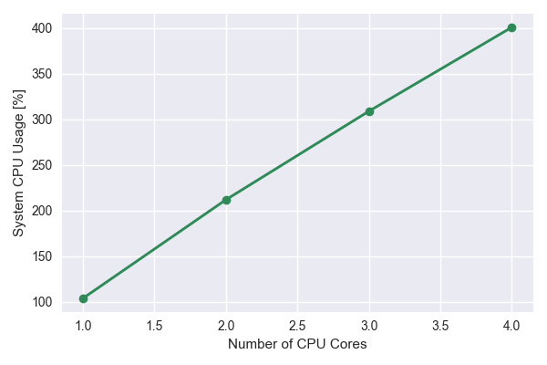
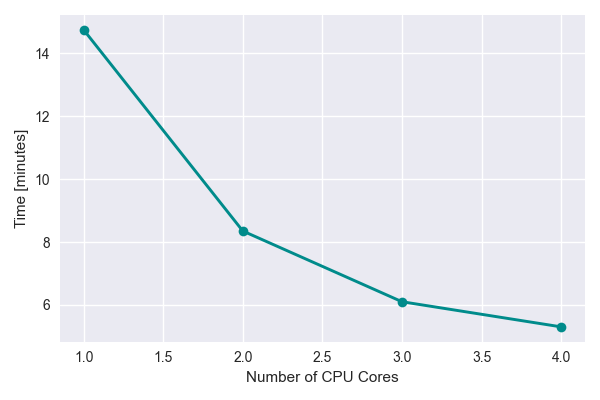
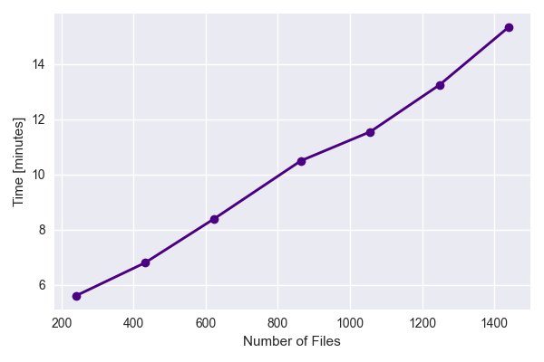
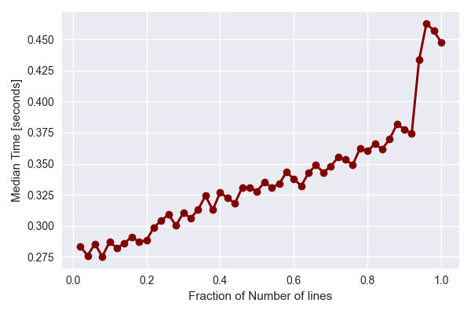

=============
 Performance
=============

The *EMBERS* pipline comes with a series of command-line tools for batch processing data. These tools are parallelized to process large volumes of data using 
all available CPU cores. Exampes of these tools and their usage are available on the :doc:`EMBERS by Exampe Page <embersbyexample>`. The most resource hungry 
section of the pipline is the :samp:`align_batch` tool, which temporally aligns pairs of RF data files, interpolates them down to lower frequencies and smooths
noisy data using a `SavGol Filter <https://docs.scipy.org/doc/scipy/reference/generated/scipy.signal.savgol_filter.html>`_. When running EMBERS of a laptop, it 
may be advisible to use the :samp:`--max_cores` option to limit the number of cores availible to this tool. Below, we analyse the performance 
of the :samp:`align_batch` tool.

Parallel Performance Test
-------------------------

To get a handle of the parallel performance of :samp:`align_batch`, the :samp:`--max_cores` option was used to time the execution of the tool with between 1 and 4 
CPU cores. The GNU :samp:`time` tool was used to gauge performance.

The terminal outputs of a test on a laptop are shown below:

.. code-block::
    
    $ time align_batch --out_dir=tmp --max_cores=1
    >>> Aligned files saved to: tmp
    >>> align_batch --out_dir=tmp --max_cores=1  879.14s user 47.24s system 104% cpu 14:45.86 total
    
    $ time align_batch --out_dir=tmp --max_cores=2
    >>> Aligned files saved to: tmp
    >>> align_batch --out_dir=tmp --max_cores=2  999.20s user 72.56s system 212% cpu 8:23.51 total
    
    $ time align_batch --out_dir=tmp --max_cores=3
    >>> Aligned files saved to: tmp
    >>> align_batch --out_dir=tmp --max_cores=3  1012.36s user 129.45s system 309% cpu 6:08.94 total
    
    $ time align_batch --out_dir=tmp --max_cores=4
    >>> Aligned files saved to: tmp
    >>> align_batch --out_dir=tmp --max_cores=4  1143.28s user 137.17s system 401% cpu 5:18.70 total

The system cpu usage vs number of cpu cores increases linearly as expected

The time vs number of CPU cores seems to fall off at higher number of cores. This could partially be due to limited resources available on the laptop.

Single Core Performance
-----------------------

:samp:`align_batch` was re-run with :samp:`--max_core=1` option set to limit the tool to a single CPU core. The number of files were varied to understand the 
how the performance scaled with increasing number of files. The results indicate a linear increase in processing time with increasing data files.

Finally, we test the perfomance on a single tile while varying the amount of data per file. This is done by only analysing various fractions of the data array
in a single file and timing the perfomance. 

The results show that while the processing time increases linearly with the amount of data per file, there is a significant overhead attributed to reading the 
data from disk. Each file typically takes ~200 ms to read in, before it can be analysed. This may result from the decoding process from binary to floats. 

For a more details discussion on the perfomance aspects of the tool, check out the comments at the bottom of the following `Github Issue <https://github.com/openjournals/joss-reviews/issues/2629>`_.
